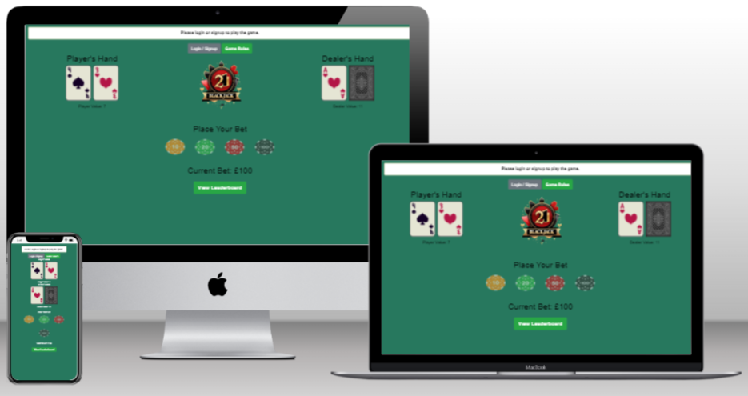

# Blackjack 21 Game with Python, Flask, and MongoDB

## Milestone Three - Backend Development 

## Blackjack 21 Game - [View the live project here](https://blackjack-21-43c557ed8b44.herokuapp.com/)




## Project Overview

Welcome to the Blackjack 21 Game! This is a web-based version of the classic card game where the goal is to reach a hand value of 21 without going over. 
Play against the dealer, test your luck, and see if you can make it to the top of the leaderboard!

This project is a web-based Blackjack 21 game built using Python, Flask, and MongoDB. The application allows users to play Blackjack, place bets, and track their game history. The project is structured to offer a dynamic and interactive user experience.

## Project Scope and Features

### Core Features
- **User Authentication**: Users can sign up, log in, and manage their profiles.
- **Gameplay Mechanics**: Standard Blackjack rules, including hit, stand, and bust logic.
- **Betting System**: Users can place bets, and the system will manage their balance and winnings.
- **Leaderboard**: A leaderboard to show the top players based on their winnings.
- **Game History**: Track and view historical game results.

### Technology Stack
- **Backend**: Python, Flask
- **Database**: MongoDB
- **Frontend**: HTML, CSS (Bootstrap), JavaScript

## Project Structure and Development Process

### 1. Define the Project Scope and Requirements
- **Game Rules**: Outline the specific rules of Blackjack 21, including card values, betting rules, and win/loss conditions.
- **Betting System**: Design the betting system to handle user bets and calculate winnings or losses.
- **User Interactions**: Define how users will interact with the game, including placing bets, playing hands, and viewing game history.

### 2. Implement Core Game Logic

- **Deck Management**: Handle card creation, shuffling, and dealing.
- **Hand Evaluation**: Implement logic to evaluate hand values and determine game outcomes.
- **Player Actions**: Allow players to hit, stand, or make other choices during gameplay.
- **Dealer Actions**: Implement dealer behavior based on standard Blackjack rules.

### 3. Design Wireframes and User Flow
- **Wireframes**: Create designs for key screens such as:
-- **Main Game Page**: Where the user plays Blackjack.
-- **In-Game Page**: Shows the current game state, options to hit or stand, and displays cards.
-- **Leaderboard**: Displays the top players based on their winnings.
-- **User Profile Dashboard**: Shows user balance, game history, and personal statistics.

### 4. Develop Database Models and Integration
- **User Management**: Create and manage user accounts, including authentication and profile management.
- **Game History**: Record each game's outcome for user tracking and analytics.
- **Leaderboard**: Maintain a leaderboard to display top players and their winnings.

### 5. Design User Interface

- **HTML Templates**: Create and style pages for the main game, leaderboard, and user dashboard.
- **Static Files**: Include CSS (e.g., Bootstrap) and JavaScript for dynamic behavior and styling.

### Wireframes

Wireframes were created using [miro](https://miro.com/wireframe/) wireframe editor. Layouts were created for mobile and desktop to assist the design decisions before coding.

* [Game-main-page](wireframes/blackjack-main.jpg)
* [Game-start-game](wireframes/blackjack-game.jpg)
* [Game-in-gameplay](wireframes/blackjack-in-game.jpg)
* [Game-end-page](wireframes/blackjack-end.jpg)
* [Leaderboard-page](wireframes/blackjack-leaderboard.jpg)
* [Dashboard-account-page](wireframes/blackjack-dashboard.jpg)

### Existing Features

### 1. User Authentication
  - Login/Logout: Players can log in and log out using a secure authentication system.
  - Password Match Validation: Real-time password match validation and toggle password      visibility in the dashboard and user sigup page.

### 2. Player Balance Management
   - Initial Balance: All user accounts start with a balance of £1000.
   - Balance Persistence: The player’s balance is stored in MongoDB and carried forward    into new games if it's greater than £0.
   - Balance Reset on Game Over: If the player's balance reaches £0, it resets to £1000.
   - Balance Retrieval: On logging in, the balance is retrieved from the database.

### 3. Game Logic
   - Game State Tracking: Tracks whether a game is in progress, including details like     the current bet, current balance, and game outcome.
   - Game Reset on Logout: The game resets if a player logs out during an ongoing game.
   - Hit and Stand Buttons: Game actions like hitting or standing are managed by           enabling/disabling buttons based on the game's state.

### 4. Leaderboard
   - Leaderboard Updates: The leaderboard is updated based on the player's winnings at     the end of each game.

### 5. Game History
   - Game History Display: The dashboard shows a history of game outcomes using specific   image files (e.g., dealer-bursts.png, dealer-wins.png, etc.).
   - Filtered Game History: Only specific images are shown to represent game outcomes; no text is included.

### 6. Custom Flash Messages
   - Styled Flash Messages: Flash messages are displayed in the center of the page and styled with custom CSS for better visibility (bold text, specific colors, inline display).

### 7. Database Management
 - MongoDB Integration: The game uses a non-relational MongoDB database to store user       data, game states, and leaderboard information.
 - Game and User Data Insertion: Data such as player names, winnings, and game results are successfully inserted into MongoDB collections.

### 8. Dealer Bluff Mechanism
 In the Blackjack game, the dealer has a chance to "bluff," which adds an extra layer of unpredictability. The dealer will take more risks based on a random chance, which may lead to hitting on a 
 higher hand value than usual.
   ##### How the Bluff Works:

   - The dealer normally stands when their hand reaches a value of 17 or higher.
   - However, a bluff can occur where the dealer takes additional cards, even when their hand value is 17 or above.
   - This bluff chance is determined by a random number:
     - If the dealer’s hand is between 17 and 19, there’s a 20% chance (when bluff_chance > 0.8) that the dealer will continue hitting.

 ##### Code Explanation
 ```python
bluff_chance = random.random()

# Dealer bluffs and hits on a higher value based on random chance
while self.dealer_hand.value < 17 or (self.dealer_hand.value < 19 and bluff_chance > 0.8):
    self.dealer_hand.add_card(self.draw_card())
    self.dealer_hand.adjust_for_ace()

```
- The dealer's risk-taking behavior adds more variety to the gameplay, making the outcome less predictable.
- This bluff mechanism creates moments where the dealer might take unexpected risks, potentially benefiting or disadvantaging the player.
   
### Future Features

### 1. Achievements & Rewards System
  - Badges and Trophies: Introduce achievements like “Win 10 games in a row” or “Hit        Blackjack” that reward players with badges or trophies.
  - Daily Login Rewards: Implement a reward system where players earn bonus credits or      perks for logging in daily.
  - Leveling Up: Introduce player levels or ranks that increase based on wins or time spent in the game.
 
### 2. Advanced Statistics and Insights
  - Player Performance Dashboard: Provide detailed statistics and insights into the         player’s game history, including win/loss ratios, most common outcomes, and average     winnings.
  - Personalized Tips: Offer personalized game tips based on the player’s performance       (e.g., recommending when to stand or hit based on their past decisions).
  
### 3. Player Customization
  - Profile Customization: Allow players to customize their profiles with avatars,          backgrounds, and table appearances.
  - Custom Table Layouts: Give players the ability to design their own table layouts or     card decks, enhancing personalization.  


# Technologies Used

### Languages Used

* [HTML5](https://en.wikipedia.org/wiki/HTML5)
  * For structuring the site pages.

* [CSS](https://en.wikipedia.org/wiki/Cascading_Style_Sheets)
  * For styling the content of each page.

* [JavaScript](https://en.wikipedia.org/wiki/JavaScript)
  * JavaScript for the API & contact form to function
  
* [Python](https://en.wikipedia.org/wiki/python)
  * JavaScript for the API & contact form to function

## Frameworks Libraries and Programs


* [Bootstrap 4](https://getbootstrap.com/)
  * Framework used to form the layout of each page.

* [Miro](https://miro.com/)
  * Used for creating the wireframe mockups.

* [Pexels](https://www.pexels.com/)
  * Pexels was used to source imagery for the website.

* [Youtube](https://www.youtube.com/)
  * Youtube was used to source sound effects.
 
* [Favicon.io](https://favicon.io/)
  * Added a Favicon icon to the website.

* [Adobe Photoshop](https://www.adobe.com/ie/products/photoshop.html)
  * For image editing and resizing.
 
* [Techsini](https://techsini.com/multi-mockup/)
  * Techsini was used to help check responsiveness and take screenshots of the page at different screen sizes.

* [WebFormatter](https://webformatter.com/html)
  * WebFormatter was used to help beautify the code.

* [Google Chrome Dev Tools](https://developer.chrome.com/docs/devtools/)
  * Google Chrome's Dev Tools were used while building the project to test responsiveness and for debugging.
  
* [JSHint](https://jshint.com/)
  * For help with javaScript bugs.

* [Visual Studio Code](https://code.visualstudio.com/)
  * Integrated development environment (IDE) used for development.

* [GitHub](https://github.com/)
  * Used for managing and storing my code.

* [GitHub Pages](https://pages.github.com/)
  * Used to deploy the site.

## Testing

Please refer [here](TESTING.MD) for more information on testing of the Blackjack Game.

## Deployment

### Creating a Workspace in Visual Studio Code (VS Code)

To develop the Blackjack project using **VS Code**, follow these steps:

1. **Install VS Code:** Download and install Visual Studio Code from the [official website](https://code.visualstudio.com/).
2. **Install Git:** Ensure that Git is installed on your machine by downloading it from [here](https://git-scm.com/downloads) or through a package manager like Homebrew on macOS or apt-get on Linux.
3. **Clone the Repository:** 
4. Open the Project in VS Code:

Open the folder containing the cloned project in VS Code by navigating to **File > Open Folder** and selecting the project directory.

5. **Set Up a Python Environment:**
    - Ensure Python is installed on your system. You can download it from [python.org](https://www.python.org/downloads/).
    - In VS Code, create a virtual environment by opening the terminal and running
```bash
python3 -m venv venv
```
6. **Install Project Dependencies:**
  - Once the virtual environment is activated, install the necessary Python packages by running:
```
pip install -r requirements.txt

```
---
### Forking the GitHub Repository
Forking allows you to make a copy of the original repository under your GitHub account, where you can make changes without affecting the original.

To fork the repository:

1. **Log in to GitHub** and go to the GitHub Repository.
2. Locate the **Fork** button in the top-right corner and click it.
3. You should now have a copy of the original repository in your GitHub account.

---   

### Making a Local Clone
A local clone allows you to have a copy of the repository on your local machine for development.

To make a local clone:

1. **Log in to GitHub** and navigate to the GitHub repository.
2. Above the list of files, click **Code**.
3. To clone using HTTPS, under "Clone with HTTPS", click the **copy** icon. You can also clone using SSH or GitHub CLI if preferred.
4. Open **Git Bash**.
5. Change your working directory to the location where you want the cloned directory.
6. Type the following, replacing YOUR-USERNAME and YOUR-REPOSITORY with your actual details:
```
git clone https://github.com/YOUR-USERNAME/YOUR-REPOSITORY
```
7. Press **Enter** to create the local clone.

For more detailed steps and images, refer to the [GitHub quick start guide](https://docs.github.com/en/get-started/start-your-journey).

---

## Creating an Application with Heroku

To deploy the Blackjack project, you'll need to use Heroku. Follow these steps:

### Step 1: Set Up Files for Deployment

1. **Create a** requirements.txt **file:** Run the following command in your terminal to create the file containing your project’s dependencies:

```
pip3 freeze --local > requirements.txt
```

2. **Create a** Procfile: Run the following command to create a Procfile, which tells Heroku how to run your application:

```
echo web: python routes.py > Procfile

```
Ensure the Procfile starts with a capital P and has no new line at the end, as this can cause errors.

3. **Add and commit these files to GitHub:** Use the following commands:
```bash
git add requirements.txt Procfile
git commit -m "Add deployment files"
git push origin main
```

### Step 2: Set Up the Heroku App

1. **Log in to Heroku** (or create an account if you don't have one).
2. Click **'New'** and select **'Create new app'**.
3. Enter a **unique name** for your project (no spaces or capital letters) and select your region.
4. Click **'Create App'.**

### Step 3: Configure Resources and Environment Variables

1. Go to the **Resources** tab and add the **MongoDB database as required.
2. Go to the **Settings** tab and click **'Reveal Config Vars'**.
3. Add the following configuration variables:
 - `IP: 0.0.0.0`
 - `PORT: 5000`
 - `MONGO_DBNAME:` Your MongoDB database name
 - `MONGO_URI:` Your MongoDB URI (found in MongoDB -> Clusters -> Connect -> Connect to your   application)
 - `SECRET_KEY:` Your Flask secret key
 
### Step 4: Deploy the Project
Go to the **Deploy** tab in Heroku and select **'Connect to GitHub'**.
Find your repository by name and select **Connect**.
Scroll down to the **Manual Deploy** section and click Deploy Branch to start the deployment process.

### Step 5: Set Up the Database (Optional)

1. Once deployed, go to the **More** tab in Heroku and open the **Run Console**.
2. Enter python3 to access the Python interpreter.
3. Run the following commands to initialize the database (if needed)
```python 
from routes import db
db.create_all()
```
4. Exit the console.

---

### Final Steps
Once the application is deployed, you can open it using the following command:
```
heroku open

```
To monitor logs or troubleshoot errors, use:
```
heroku logs --tail

```

---

This guide will walk you through deploying the Blackjack project from VS Code or GitHub to Heroku. Remember to replace placeholders like `YOUR-USERNAME` and `YOUR-REPOSITORY` with your actual GitHub account details.
